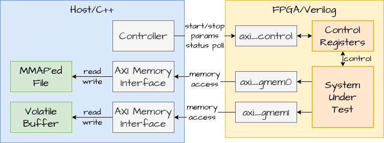

#################################
 FPGA AXI Sim for SCAD Processor
#################################

Note on problematic terms: Since they are the names chosen for the AXI standard,
I will use the terms "AXI master" and "AXI slave" here.  I really want the
standard to change to terms less burdened by past crimes, but since I have to
use external interfaces no matter what terms I choose internally, the AXI
interface names remain consistent with the standard here.  For my personal
projects or internal processor signals, I prefer the terms "requester" and
"responder", which describe the two sides of each memory interface perfectly.
(Some signals already carry "response" in their names, so there should be no
confusion.)

Design
======

Features
========

- Run Verilog/SystemVerilog RTL kernels compatible with Xilinx/AMD Vitis
- Access MMAP'ed memory from FPGA designs
- Easy to adapt to kernels with any number of AXI memory interfaces
- Configurable randomized memory delays to test delay-insensitivity of designs.
- Start and stop with Vitis compatible control register signalling, process will
  terminate when the kernel reports "done"
- VCD trace generation
- "modern" C++

Limitations
===========

- Memory delays may either be zero or have a random backoff. There are no
  provisions in place for more fine-grained control.  Adding custom delay
  systems in SystemVerilog or C++ should not be difficult tho.
- Only single-beat reads and writes are supported.
- Each memory is mapped to address 0x0 of the corresponding AXI interface. There
  is no interconnect or memory map.
- The AXI control master will write a fixed sequence of uin32_t to the
  configuration registers, you need to manually change and recompile that if
  needed.

Components Implemented in C++
=============================

AXI Memory Slave
----------------

- give an empty path to create temporary memory of a fixed 1MiB capacity
- when given a non-empty path, will memory-map the file and make it accessible
  via AXI signals
- there's a small Minsert_memory_name_here wrapper in the example, which
  is used to forward the per-bus signals to their generic AXI endpoints
  in the component
- just copy the wrapper for each AXI interface you have, see test.py for
  and example of how to do so

AXI Control Master
------------------

- start with uint32_t vector of parameters, which will be written
  to the parameter registers
- after setting parameters, this component will set and poll the correct state
  registers to emulate some bare RTL kernel controls

Example
=======

There's an example processor in the "example" directory.  It's a full processor
taken from the project this C++ wrapper was developed for.

The 

Third-Party Tools
=================

The interconnection network used in the example Verilog implementation is a
modified version of the radix-based non-blocking interconnects generated
by the Averest Framework Circuit Generators available at
https://www.avarest.org which were designed and implemented by Tripti Jain
and Klaus Schneider.

The OpenCL host wrapper is taken from AMD/Xilinx-provided examples and retains
it's own license in the source file.

Apart from Verilator, there are only two C++ libraries we depend on for the
simulation code:

Argh!
-----

Small header-only command line argument parser.

https://github.com/adishavit/argh

https://github.com/adishavit/argh.git

Mio
---

Small header-only memory mapping library.

https://github.com/vimpunk/mio

https://github.com/vimpunk/mio.git

